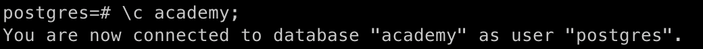

# Задание 2. Теория баз данных

## 1. Установка PostgreSQL через Docker

> Я использую macOS и Docker для работы с базой данных.

```bash
# Скачивание и запуск контейнера PostgreSQL
docker run --name pg-academy -e POSTGRES_PASSWORD=postgres -p 5432:5432 -d postgres
```


```bash
# Проверка, что контейнер работает
docker ps
```


```bash
# Подключение к PostgreSQL
docker exec -it pg-academy psql -U postgres
```


## 2. Создание базы данных `academy`

```sql
CREATE DATABASE academy;
```


## 3. Создание таблиц (по схеме)

```sql
\c academy
```


-- Таблица студентов
CREATE TABLE Students (
    s_id SERIAL PRIMARY KEY,
    name VARCHAR(100) NOT NULL,
    start_year INT CHECK (start_year >= 1900 AND start_year <= EXTRACT(YEAR FROM CURRENT_DATE))
);
-- Проверка
SELECT * FROM Students;

-- Таблица курсов
CREATE TABLE Courses (
    c_no SERIAL PRIMARY KEY,
    title VARCHAR(100) NOT NULL,
    hours INT CHECK (hours > 0)
);
-- Проверка
SELECT * FROM Courses;

-- Таблица экзаменов
CREATE TABLE Exams (
    s_id INT REFERENCES Students(s_id),
    c_no INT REFERENCES Courses(c_no),
    score INT CHECK (score >= 0 AND score <= 100),
    PRIMARY KEY (s_id, c_no)
);
-- Проверка
SELECT * FROM Exams;
```

> Я пробовала добавить `UNIQUE` на имя студента, но потом поняла, что имена могут повторяться, и убрала. Также пыталась задать `DEFAULT` значение для года, но не получилось.


## 4. Вставка тестовых данных

```sql
-- Студенты
INSERT INTO Students (name, start_year) VALUES
('Alice', 2020),
('Bob', 2021),
('Charlie', 2022);
-- Проверка
SELECT * FROM Students;

-- Курсы
INSERT INTO Courses (title, hours) VALUES
('Mathematics', 100),
('History', 80);
-- Проверка
SELECT * FROM Courses;

-- Экзамены
INSERT INTO Exams (s_id, c_no, score) VALUES
(1, 1, 85),
(1, 2, 90),
(2, 1, 75);
-- Проверка
SELECT * FROM Exams;
```


## 5. Запрос: студенты без экзаменов

```sql
SELECT s.*
FROM Students s
LEFT JOIN Exams e ON s.s_id = e.s_id
WHERE e.s_id IS NULL;
```


## 6. Запрос: студенты и количество сданных экзаменов

```sql
SELECT s.name, COUNT(e.c_no) AS exam_count
FROM Students s
JOIN Exams e ON s.s_id = e.s_id
GROUP BY s.name
HAVING COUNT(e.c_no) > 0;
```


## 7. Запрос: курсы и средний балл, по убыванию

```sql
SELECT c.title, AVG(e.score) AS avg_score
FROM Courses c
JOIN Exams e ON c.c_no = e.c_no
GROUP BY c.title
ORDER BY avg_score DESC;
```


## 8*. Генерация данных вручную (псевдослучайно)

> Я пробовала делать генератор через цикл, но не разобралась. Поэтому сделала руками.

```sql
-- Студенты
INSERT INTO Students (name, start_year) VALUES ('Student_1', 2020);
INSERT INTO Students (name, start_year) VALUES ('Student_2', 2021);
INSERT INTO Students (name, start_year) VALUES ('Student_3', 2019);
INSERT INTO Students (name, start_year) VALUES ('Student_4', 2022);
INSERT INTO Students (name, start_year) VALUES ('Student_5', 2023);
-- Проверка
SELECT * FROM Students;

-- Курсы
INSERT INTO Courses (title, hours) VALUES ('Course_A', 40);
INSERT INTO Courses (title, hours) VALUES ('Course_B', 60);
INSERT INTO Courses (title, hours) VALUES ('Course_C', 45);
-- Проверка
SELECT * FROM Courses;

%%Экзамены
INSERT INTO Exams (s_id, c_no, score) VALUES (1, 1, 78);
INSERT INTO Exams (s_id, c_no, score) VALUES (1, 2, 88);
INSERT INTO Exams (s_id, c_no, score) VALUES (2, 1, 91);
INSERT INTO Exams (s_id, c_no, score) VALUES (3, 3, 65);
-- студент 4 и 5 пока не сдавали экзамены
-- Проверка
SELECT * FROM Exams;
```
