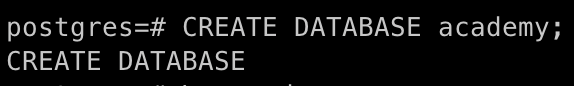
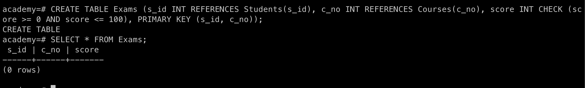

# Задание 2. Теория баз данных

## 1. Установка PostgreSQL через Docker

> Я использую macOS и Docker для работы с базой данных.

```bash
# Скачивание и запуск контейнера PostgreSQL
docker run --name pg-academy -e POSTGRES_PASSWORD=postgres -p 5432:5432 -d postgres
```


```bash
# Проверка, что контейнер работает
docker ps
```


```bash
# Подключение к PostgreSQL
docker exec -it pg-academy psql -U postgres
```


## 2. Создание базы данных `academy`

```sql
-- Создание базы
CREATE DATABASE academy;
```


## 3. Создание таблиц (по схеме)

```sql
-- Подключение к базе
\c academy
```


```sql
-- Таблица студентов
CREATE TABLE Students (s_id SERIAL PRIMARY KEY, name VARCHAR(100) NOT NULL, start_year INT CHECK (start_year >= 1900 AND start_year <= EXTRACT(YEAR FROM CURRENT_DATE)));
```


```sql
-- Таблица курсов
CREATE TABLE Courses (c_no SERIAL PRIMARY KEY, title VARCHAR(100) NOT NULL, hours INT CHECK (hours > 0));
-- Проверка
SELECT * FROM Courses;
```


```sql
-- Таблица экзаменов
CREATE TABLE Exams (s_id INT REFERENCES Students(s_id), c_no INT REFERENCES Courses(c_no), score INT CHECK (score >= 0 AND score <= 100), PRIMARY KEY (s_id, c_no));
-- Проверка
SELECT * FROM Exams;
```


> Я пробовала добавить `UNIQUE` на имя студента, но потом поняла, что имена могут повторяться, и убрала. Также пыталась задать `DEFAULT` значение для года, но не получилось.

## 4. Вставка тестовых данных

```sql
-- Студенты
INSERT INTO Students (name, start_year) VALUES ('Alice', 2020), ('Bob', 2021), ('Charlie', 2022); SELECT * FROM Students;

-- Курсы
INSERT INTO Courses (title, hours) VALUES ('Mathematics', 100), ('History', 80); SELECT * FROM Courses;

-- Экзамены
INSERT INTO Exams (s_id, c_no, score) VALUES (1, 1, 85), (1, 2, 90), (2, 1, 75); SELECT * FROM Exams;
```


## 5. Запрос: студенты без экзаменов

```sql
SELECT * FROM Students WHERE s_id NOT IN (SELECT s_id FROM Exams);
```


## 6. Запрос: студенты и количество сданных экзаменов

```sql
SELECT name, COUNT(c_no) AS exam_count FROM Students s JOIN Exams e ON s.s_id = e.s_id GROUP BY name HAVING COUNT(c_no) > 0;
```


## 7. Запрос: курсы и средний балл, по убыванию

```sql
SELECT title, AVG(score) AS avg_score FROM Courses c JOIN Exams e ON c.c_no = e.c_no GROUP BY title ORDER BY avg_score DESC;
```


## 8*. Генерация данных вручную (псевдослучайно)

> Я пробовала делать генератор через цикл, но не разобралась. Поэтому сделала руками.

```sql
-- Студенты
INSERT INTO Students (name, start_year) VALUES 
('Alice', 2020), 
('Bob', 2021), 
('Charlie', 2022), 
('Diana', 2023), 
('Eve', 2021);
SELECT * FROM Students;

-- Курсы
INSERT INTO Courses (title, hours) VALUES 
('Mathematics', 100), 
('History', 80), 
('Biology', 60);
SELECT * FROM Courses;

-- Экзамены
INSERT INTO Exams (s_id, c_no, score) VALUES 
(1, 1, 85), 
(1, 2, 90), 
(2, 1, 75), 
(3, 3, 88), 
(4, 2, 79);
SELECT * FROM Exams;
```

